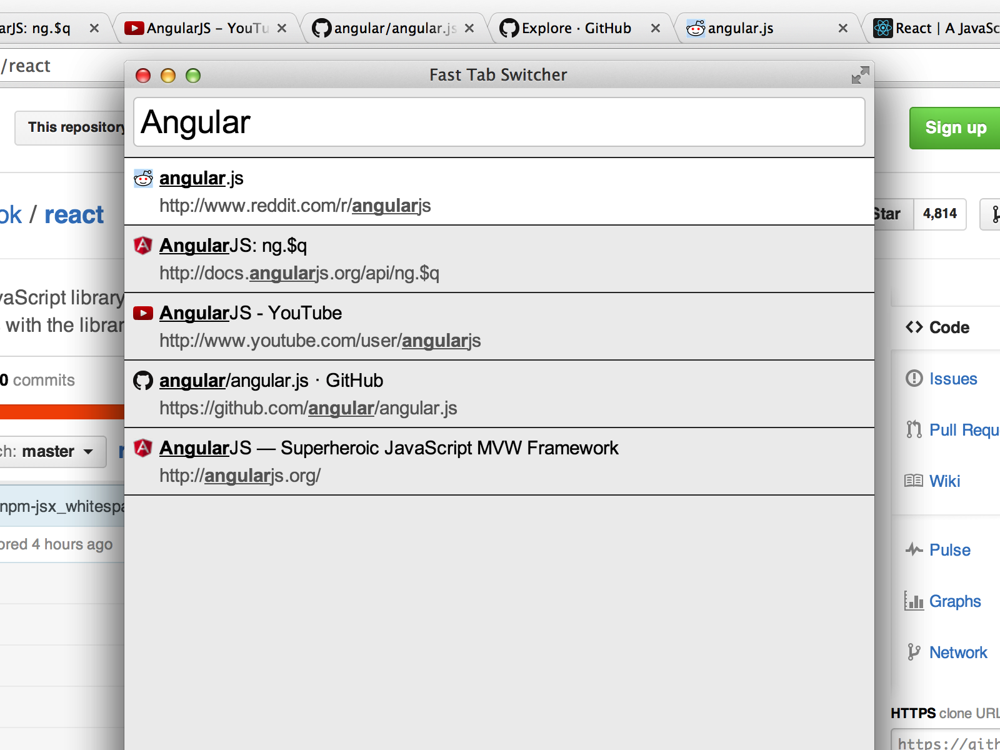

Chrome Fast Tab Switcher
========================

This Chrome extension allows you to switch between Chrome tabs in your active window quickly using your keyboard.

You can [install this extension from the Chrome Web Store](https://chrome.google.com/webstore/detail/fast-tab-switcher/jkhfenkikopkkpboaipgllclaaehgpjf) if you do not wish to install it from source.

Usage
-----

The default keyboard shortcut is `Ctrl+Shift+Comma` (`Cmd+Shift+Comma` on OS X). You can, and may need to, adjust your keyboard shortcuts via the link at the very bottom of your Chrome extensions page at `chrome://extensions`.

Installing from Source
----------------------

 * Visit `chrome://extensions/`
 * Ensure `Developer mode` is checked
 * Click `Load unpacked extension...`
 * Locate and select the directory with the `manifest.json` file in it

Hacking
-------

You must have [Node.js](http://nodejs.org/) installed to build the extension.

1. Install the dependencies: `npm install`
2. Build the extension from `src/js` into `build/js`:
  * Build once: `npm run build`
  * Build continuously as files change: `npm run watch`

Tests
-----

Run the test suite with `npm test`.

Run JSHint on the source with `npm run jshint`.
