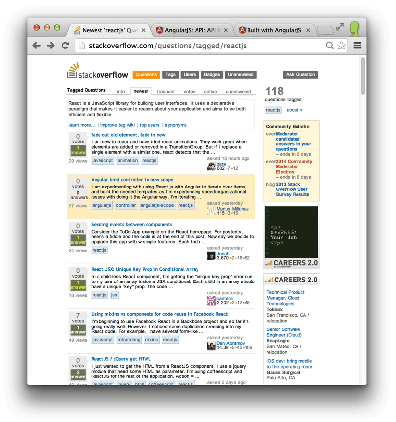

Chrome Fast Tab Switcher
========================

This Chrome extension allows you to switch between Chrome tabs in your active window quickly using your keyboard.

You can [install this extension from the Chrome Web Store](https://chrome.google.com/webstore/detail/fast-tab-switcher/jkhfenkikopkkpboaipgllclaaehgpjf) if you do not wish to install it from source.

You may also be interested in [a blog post](http://brandontilley.com/2014/02/24/creating-chrome-extensions-with-react.html) I wrote about building this extension with React.

Usage
-----

The default keyboard shortcut is `Ctrl+Shift+Comma` (`Cmd+Shift+Comma` on OS X). You can, and may need to, adjust your keyboard shortcuts via the link at the very bottom of your Chrome extensions page at `chrome://extensions`.

`Alt+a` (`Option+a` on OS X) can be used to toggle the "Show tabs from all windows" option.

Installing from Source
----------------------

 * Visit `chrome://extensions/`
 * Ensure `Developer mode` is checked
 * Click `Load unpacked extension...`
 * Locate and select the directory with the `manifest.json` file in it

Hacking
-------

You must have [Node.js](http://nodejs.org/) installed to build the extension.

1. Install the dependencies: `npm install`
2. Build the extension from `src/js` into `build/js`:
  * Build once: `npm run build`
  * Build continuously as files change: `npm run watch`

The entry point for the extension's background page is `src/js/background.js`. It is responsible for communicating the list of open tabs to the client when requested.

The entry point for the extension's front-end is `src/js/client.jsx`. The client is written using [React](http://facebook.github.io/react/).

Both these files are bundled using [Browserify](http://browserify.org/) (running a JSX transform for the client scripts) into `build/js`. At runtime, the extension uses only files from `build` and `vendor`.

Tests
-----

Run the test suite with `npm test`.

Run JSHint on the source with `npm run jshint`.
